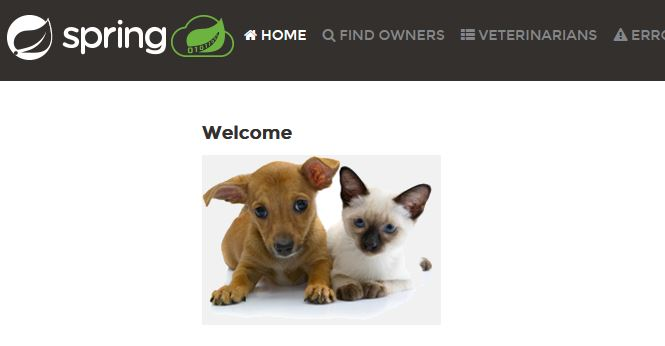

# Labo02 - Run a Spring App Locally

## Pedagogical intent
In this lab, we'll be taking the application we're going to evolve into our own hands, to discover the Spring architecture.

---

## Task 01 - Run the app

### Use Maven to package the solution

* [Maven Doc](https://maven.apache.org/guides/getting-started/maven-in-five-minutes.html#build-the-project)

```bash
mvn package
```

* What operation does maven perform ?

```
The command first compile the project, then run the test if they are configured.
Then it produce and JAR or EXE file wich can be used in other project.
The files is created following the instruction in the "pom.xml" file.
```

* What java dependencies are needed to make this work?

```
Those dependencies are defined in the "pom.xml" file.
The file specifie dependencies, plugins, and other configuration for the project.
```

* Where do we find the pre-compiled application after that?

```
In the forlder "target" at the root of the project
```

* Delete the folder containing the pre-compiled application, try again to observe the process.

* Is it a build ready for prod ?

```
Depending on our environment, we may need to add some configuration to the "pom.xml" file.
Then at "src/main/ressources/application.properties" we can add some configuration for the prod environment.
Three files are created by defaults "application.properties", "application-dev.properties" and "application-prod.properties".
Those three files contain the configuration for the three environment.
So at the moment our build is not ready for prod.
```

### Use Java to launch the application

* [The java command](https://docs.oracle.com/en/java/javase/14/docs/specs/man/java.html)

```bash
"in the target directory /target/*-SNAPSHOT.jar"
java -jar spring-petclinic-3.2.0-SNAPSHOT.jar
```

* Try to access to the app via your browser

```
Go to localhost:8080
```

* You should get this page



* Stop the app

## Use the Spring Boot Maven plugin to launch the application

* [Maven plug in to run the app](https://docs.spring.io/spring-boot/docs/current/maven-plugin/reference/htmlsingle/#run)

```bash
"in the root of the project"
mvn spring-boot:run

[Update]
"Running only 'mvn spripring-boot:run' use the default maven configuration
Instead we should run :"
mvnw spring-boot:run
"Wich use the maven wrapper and the configuration in the folder files"
```

---

## Task 02 - Explore the app

### Kind of app

* How can we access a home page via our browser?

```
By going to localhost:8080
```

* Go to http://localhost:8080/owners/find and add an owner

* Using the search function, can you find it?

* Relaunch the application and try again. How is data persistence ensured?

```
Data are actually not saved anywhere, it is lost once the application is stopped.
```

* How many logic layers are implemented on this application?

```
Looks like the three layers are implemented. (User interface, Business logic, Database) But somehow we lack the implementation of saving the data. 
```

---
## Task 03 - Docker - First Analysis

* At this stage of the analysis, can you imagine a little better what kind of needs Docker could help us with?

```
Docker will probably help us to save the data, and to deploy the application on a server.
```

* Try to list the tasks to be carried out to obtain two tiers, one hosting the application part locally and the second tier using Docker for the database engine.

```
- Create a Docker container for the database engine
- Configurate the application to use the container (set host, port, user, password)
- Expose the Docker container to the host
- Use Docker compose to manage all the parameters
```
